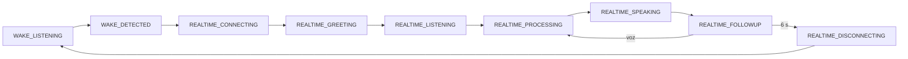

# F1 Realtime audio lifecycle

Un único `F1AudioSessionController` coordina Wake Engine, OpenAI Realtime y briefing. React solo refleja snapshots y dispara comandos.

## Garantías
- Un solo propietario del micrófono.
- Cierre idempotente de DataChannel, PeerConnection y MediaStreamTracks.
- Saludo `Te escucho` emitido por OpenAI Realtime; no usa `speechSynthesis`.
- Seguimiento 6 s, inactividad 15 s y máximo absoluto 2 min.
- Todas las salidas regresan al Wake Engine cuando el motor permanece habilitado.

## Blindaje de continuidad (429 + transporte)
- Los 429/TPM reintentan `response.create` sin derribar la conversación.
- Una caída inesperada del DataChannel intenta reconstruir WebRTC hasta 3 veces sin volver al Wake Engine.
- Se conserva un checkpoint corto de los últimos turnos y resultados de herramientas para retomar la conversación.
- Los `call_id` ya ejecutados se conservan durante la recuperación y nunca se envía un `function_call_output` de una sesión vieja a una sesión nueva.
- Si una herramienta estaba en vuelo cuando cayó WebRTC, la recuperación espera su resultado antes de reinyectar el checkpoint, reduciendo el riesgo de duplicar acciones.
- El límite de salida de Hanna no se reduce; este módulo no modifica `F1_REALTIME_MAX_OUTPUT_TOKENS`.
