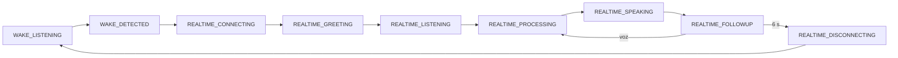

# F1 Realtime audio lifecycle

Un único `F1AudioSessionController` coordina Wake Engine, OpenAI Realtime y briefing. React solo refleja snapshots y dispara comandos.

## Garantías
- Un solo propietario del micrófono.
- Cierre idempotente de DataChannel, PeerConnection y MediaStreamTracks.
- Saludo `Te escucho` emitido por OpenAI Realtime; no usa `speechSynthesis`.
- Seguimiento 6 s, inactividad 15 s y máximo absoluto 2 min.
- Todas las salidas regresan al Wake Engine cuando el motor permanece habilitado.

